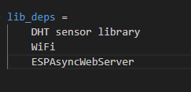

# ESP32 Web Server assíncrono usando DHT22

<!-- Explicar o que é um web server  -->
<!-- Explicar o que é um web server assincrono -->
<!--  -->

O projeto foi desenvolvido usando o ambiente de desnevolvimento (IDE) Visual Studio Code usando a 
extenção PlatforIO 

### Etapas de implementação

#### 1 - Inclução das bibliotecas 
As bibliotecas usadas no projeto foram:
- DHT sensor Libary (leitura dos dados recebido pelo sensor).
- WiFi (Conexão a rede wifi)
- ESPAsyncWebServer (Cria WebServer assíncrono com Esp32)

Elas foram chamadas no arquivo platformio.ini

#### 2- Arquivo main.cpp

O arquivo dentro da pasta src é o arquivo principal dessa aplicação que será enviado ao microcontrolador 
Ele tem como suas partes principais:

- Configurações inicias: Definições das bibliotecas, pino, sensor, porta do servidor, definição da página html usada
- Função getSensorData: Função que retorna os dados do sensor em formato JSON
- Função setup: Função geral onde são realizada todas as configurações
- Função loop: Definida por padrão mas não usada pois o servidor é assíncrono e as requisições são processadas automaticamente

# Teste pra Chico
<!--
#### 3 - Personalização da página web 
#### 4 - Resultados
-->
